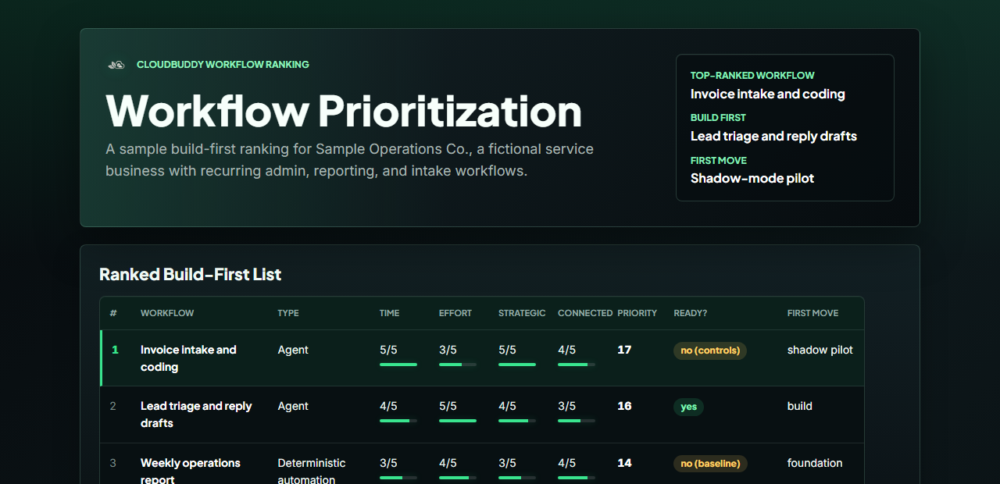

# AI Workflow Ranking



A free Claude and Codex skill that helps you decide **which workflow in your business to automate with AI first.**

Most AI projects fail at the first decision: picking the wrong workflow to start with. This skill is a guided diagnostic that turns "we should use AI somewhere" into a ranked, defensible plan. It inventories your recurring workflows, scores each one on readiness and opportunity, separates work that needs an agent from work that does not, and recommends a single first build with the controls it needs before it runs.

The output is a ranked table and a one-page plan. Not an open-ended chat.

Built by [CloudBuddy Solutions](https://cloudbuddyapps.com), the team behind CloudBuddy. Read the companion write-up: [AI Workflow Ranking](https://cloudbuddyapps.com/blog/ai-workflow-ranking/).

## What you get

- A ranked build-first list of your workflows, with an automation type for each (deterministic automation, agent, or human-judgment-stays).
- A recommended first build, and an honest note when the highest-value workflow is not the best one to build first.
- A readiness gate that tells you when the right first move is to measure or fix data before building anything.
- A simple system sketch of how your work moves from intake to understanding to decisions to self-running.
- A static HTML report with the CloudBuddy logo, a clean ranking table, the recommendation, and open questions.

## Sample output

This example uses a fictional service business walkthrough. The generated report is static HTML: no scripts, no tracking, no external calls.

See the full sample report at [cloudbuddyapps.com/github/workflow-ranking-sample-report.html](https://cloudbuddyapps.com/github/workflow-ranking-sample-report.html), or view the local copy at [`examples/sample-report.html`](examples/sample-report.html).

## What this is made of

This skill is **plain markdown. No executable code, no scripts, no hooks, no MCP servers, no network calls.** It is a set of instructions an AI assistant reads to run the diagnostic with you. You can read every line before you install it:

- [`skills/ai-workflow-ranking/SKILL.md`](skills/ai-workflow-ranking/SKILL.md): the diagnostic flow.
- [`skills/ai-workflow-ranking/reference/`](skills/ai-workflow-ranking/reference/): the lever scan, the ranking method, and the output template.
- [`skills/ai-workflow-ranking/assets/`](skills/ai-workflow-ranking/assets/): the CloudBuddy logo and packaged local fonts used in the HTML report.
- [`THIRD_PARTY_NOTICES.md`](THIRD_PARTY_NOTICES.md): license notes for the packaged local fonts.

Nothing here executes on your machine. The HTML report is static: no scripts, no tracking, no external calls.

## Install

### Codex

```
codex plugin marketplace add cloudbuddy-solutions/ai-workflow-ranking
```

Then open Codex, install `ai-workflow-ranking` from the `cloudbuddy` marketplace, start a new thread, and say:

```
Use the AI Workflow Ranking skill to help me decide which workflow in my business to automate first.
```

### Claude Code

```
/plugin marketplace add cloudbuddy-solutions/marketplace
/plugin install ai-workflow-ranking@cloudbuddy
```

Then start a session and say:

```
Use the AI Workflow Ranking skill to help me decide which workflow in my business to automate first.
```

### Claude (web or desktop app)

The web and desktop apps do not use plugin marketplaces. To add the skill there:

1. Download this repository (green **Code** button, then **Download ZIP**, or clone it).
2. Open the `skills/ai-workflow-ranking` folder.
3. In Claude, go to **Settings, then Capabilities, then Skills** and upload that folder (zipped).
4. Start a new chat and ask the same prompt above.

If you would rather not fuss with files, email [info@cloudbuddyapps.com](mailto:info@cloudbuddyapps.com) and we will get you set up.

### Other AI harnesses

Any assistant or harness that supports markdown skills or custom instructions can use the `skills/ai-workflow-ranking` folder directly. Start with `SKILL.md`; load the files in `reference/` only when the skill asks for them.

## How to use it

1. Have a rough list of your recurring workflows handy (invoice intake, quote approval, lead triage, reporting, onboarding, compliance checks, customer replies). You can also build the list with the skill one workflow at a time.
2. Run the prompt above.
3. Answer one question at a time. Ground your answers in real numbers where you can.
4. You will end with a ranked table, a recommended first build, the open questions to resolve before building, and a static HTML report when your assistant can create files.

## Want it run with you?

This skill is free and self-serve. **Workflow Mapping** is the paid guided version: CloudBuddy runs the diagnostic with you, challenges the assumptions, and turns the ranking into a build-ready recommendation for your actual workflows. See [cloudbuddyapps.com/ai-workflow-mapping](https://cloudbuddyapps.com/ai-workflow-mapping), or email [info@cloudbuddyapps.com](mailto:info@cloudbuddyapps.com).

## License

[CC BY 4.0](LICENSE). Free to use, adapt, and share, including commercially. Just credit CloudBuddy Solutions and link back.
